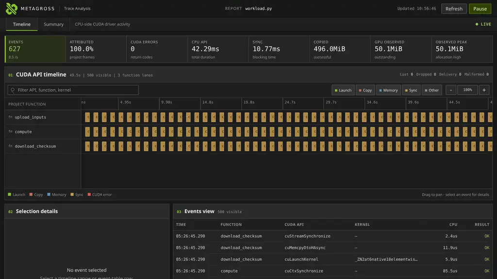

<picture>
  <source media="(prefers-color-scheme: dark)" srcset="assets/logo-dark.svg">
  
</picture>

[](https://github.com/abhiksark/metagross/actions/workflows/test.yml)

# Metagross

Watch selected CUDA driver calls update live, grouped by the Python project
function that caused them. Metagross reports host-side API elapsed time, not
GPU kernel execution time or utilization.

This experimental, source-only public preview traces one trusted Python workload
without changing normal target stdout; trace rows go to stderr by default.



*Live Docker capture: 627 CUDA driver calls across three attributed project functions.*

## What you get

- Live attribution for selected launch, copy, allocation, and synchronization
  driver calls.
- A function-grouped timeline, event details, and aggregate rankings without
  workload source instrumentation.
- Optional named regions via `metagross.span("name")`, an opt-in context
  manager that groups events by a script-chosen label alongside function
  attribution; a no-op when the script runs outside a trace.
- Optional stable JSONL and final summary files for durable captures.

<a id="quick-start"></a>
## Quick start: trace your script live

Live tracing needs Linux, an NVIDIA GPU and compatible driver, root/sudo, BPF
support, running-kernel headers, and Python 3.10+. On Ubuntu, use the system
Python and BCC bindings:

```sh
git clone https://github.com/abhiksark/metagross.git
cd metagross
sudo apt install python3-bpfcc "linux-headers-$(uname -r)"
```

Run both terminals from this repository directory.

1. **Terminal one: start the unprivileged loopback receiver.**

   ```sh
   export METAGROSS_DASHBOARD_TOKEN="$(/usr/bin/python3 -c 'import secrets; print(secrets.token_urlsafe(32))')"
   printf 'Copy this token into the tracing terminal: %s\n' "$METAGROSS_DASHBOARD_TOKEN"
   /usr/bin/python3 -B -m metagross view --web --receive --port 8765
   ```

   Open the complete private URL printed by the receiver.
   Its `#viewer_token=…` browser credential differs from the producer token and
   disappears from the visible URL after entering browser session storage.
   A new tab needs the complete URL again, or paste it into the field the page
   shows.
   Keep the URL private. To view it from another machine on a trusted internal
   network, add `--host 0.0.0.0` instead of proxying the port, and read the
   warning it prints. Public addresses and public-internet clients are refused
   as defense in depth; this does not replace a firewall.

2. **Terminal two: trace your script** with the copied producer token.

   The controller loads BPF as root but drops the target to the validated sudo
   caller. Run only trusted local scripts; preserve only the producer variable
   across sudo:

   ```sh
   export METAGROSS_DASHBOARD_TOKEN='paste the copied token here'
   PROJECT_ROOT="/absolute/path/to/your/project"
   WORKLOAD="$PROJECT_ROOT/path/to/workload.py"
   sudo --preserve-env=METAGROSS_DASHBOARD_TOKEN \
     /usr/bin/python3 -B -m metagross \
     --dashboard-port 8765 \
     --project-root "$PROJECT_ROOT" \
     "$WORKLOAD"
   ```

Watch `WAITING → LIVE → COMPLETE` when the final summary reconciles. Target
stdout stays target-owned; trace rows remain on stderr by default. Keep the
receiver and browser tab open: rerunning the producer replaces the prior
in-memory capture and repopulates the same tab automatically.
`LIVE`, `INCOMPLETE`, `MISMATCH`, or malformed warnings are not final evidence
of a loss-free capture.

When finished, stop the receiver with Ctrl-C and clear the token in **both shells**:

```sh
unset METAGROSS_DASHBOARD_TOKEN
```

Direct delivery is in-memory: stopping the receiver loses the capture. For a
durable recording, see [JSONL and summary output](docs/reference.md#output).

## Point Metagross at your workload

- `PROJECT_ROOT` is the absolute project boundary used for attribution.
- `WORKLOAD` must be a regular `.py` file inside that root; `/usr/bin/python3`
  must be able to import its dependencies.
- Put Metagross options before `"$WORKLOAD"`; append target arguments after it
  and they pass through unchanged.

One launched Python process is traced; there is no existing-PID attach,
subprocess capture, or `python -m` target form. See the
[complete CLI and interpreter contract](docs/reference.md#usage) or the
[prepared-container route](examples/docker/README.md).

Optionally mark named regions of your own code with `import metagross` and
`with metagross.span("step"): ...`; every CUDA call attributed inside that
block carries `"step"` in its `span` field, in table output and JSONL alike.
See [op spans](docs/reference.md#op-spans) and the annotated
[`examples/quicklook.py`](examples/quicklook.py).

## What the dashboard shows

| Label | Meaning |
|-------|---------|
| Activity | Events / event rate, attributed percentage, and nonzero raw CUDA return codes. |
| Host timing | Accumulated CPU API elapsed time and its synchronization-call subset. |
| Data / memory | Successful copied bytes and current/peak successfully observed driver allocations, not device-wide utilization or tensor memory. |
| Views | Bounded recent events grouped by function, plus aggregate API, function, and kernel rankings. |

Only a reconciled final summary yields `COMPLETE`; `INCOMPLETE`, `MISMATCH`, or
malformed warnings mean the capture cannot be treated as complete.
`LIVE` is not final evidence of a loss-free capture.
See the [HTTP fields and schema](docs/reference.md#local-http-interface) and
[storage and display bounds](docs/reference.md#storage-and-display-bounds).

## Other ways to start

- [Sanitized no-GPU dashboard replay](examples/captures/README.md).
- [Prepared Docker workload, alternate workloads, and benchmarks](examples/docker/README.md).
- [Durable JSONL and final summary capture](docs/reference.md#output) and
  [snapshot/follow viewers](docs/reference.md#viewer-option-reference).

Both help commands run without root, BCC, CUDA, or a GPU:

```sh
/usr/bin/python3 -m metagross --help
/usr/bin/python3 -m metagross view --help
```

## When Metagross fits

| Question | Tool |
|----------|------|
| Which project function launched, copied, allocated, or synchronized through CUDA? | Metagross: connect selected driver calls to active Python project frames. |
| How do GPU execution and CPU/GPU overlap behave? | [NVIDIA Nsight Systems](https://developer.nvidia.com/nsight-systems). |
| Why is an individual GPU kernel slow? | [Nsight Compute](https://developer.nvidia.com/nsight-compute). |
| Which operators, autograd work, or tensor allocations dominate? | A framework profiler. |

## Requirements and limits

- Selected CUDA driver APIs in one launched Python process, including its Python
  threads; no framework-wide coverage or arbitrary-image entrypoint replacement.
- Timing is host-side API elapsed time, not GPU execution time or utilization.
- Attribution and kernel names are best effort; C++ worker threads without active
  project Python frames can be unknown.
- Observed driver allocations are not tensor memory; caching allocators reuse them,
  and VMM / expandable-segment allocations are outside the traced API set.
- Profiling adds overhead; high rates and nested driver re-entry can lose events.
  Inspect warnings and final summary completeness.
- Trusted local workloads only: this is not a sandbox or production monitor.
  Keep captures and the private viewer URL private.

See the [BCC installation guide](https://github.com/iovisor/bcc/blob/master/INSTALL.md),
[full limits](docs/reference.md#overhead-and-limits), and
[privilege and trust boundary](docs/reference.md#privilege-and-trust-boundary).

## Documentation

- [Reference](docs/reference.md): all options, schemas, API coverage, file safety,
  viewer states, exit behavior, and extended limits.
- [Examples](examples/README.md): local demonstrations and function descriptions.
- [Example captures](examples/captures/README.md): sanitized replay provenance.
- [Docker guide](examples/docker/README.md): container workflow, workload portfolio,
  and benchmarks.

## Contributing and security

Issues and focused pull requests are welcome. See [Contributing](CONTRIBUTING.md)
for setup, coding conventions, unprivileged tests, and the privileged live gate.
Report vulnerabilities through [GitHub private vulnerability reporting](SECURITY.md),
not public issues. Only the latest preview commit is supported.

## License and naming

Software is available under [Apache-2.0](LICENSE). The three logo SVGs are excluded
from that software license; see [asset terms and font attribution](assets/README.md).
This preview ships from source, with no package release or stable-support promise.

Metagross is also the name of an [official Pokémon character](https://unite.pokemon.com/en-us/pokemon/metagross/).
This independent project is not affiliated with or endorsed by Pokémon, Nintendo,
Creatures, GAME FREAK, or NVIDIA. Naming clearance or a rename is required before
a stable release. The software license does not grant rights to third-party names
or marks.
